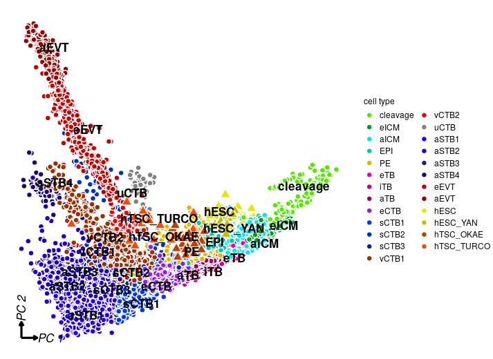

# Establish a trophoblast developmental trajectory

This respository contains the code to reproduce the results in the paper:



## Installation
The package can be installed in R using:
```r
devtools::install_github ('Yutong441/TBdev')
```

In case you would like to reuse some of our analysis pipeline, please refer to
the 'vignettes' folder for illustrations.
You may also find the data to reproduce the vignettes and the output [here](https://drive.google.com/drive/folders/1Jz2s33SLmvtXisVPTwNZtDBU4uvEInax?usp=sharing).
To alter the default parameters of the graphics, you may download a copy of the
'data-raw/config_template.R' file, alter it, and load this file into R.

## Process expression matrix
First, the raw expression matrices after alignment are processed using the
scripts in the 'manuscript/clean_data' folder. Each script processes the
expression matrix from one scRNA-seq dataset. An exception is that
'manuscript/clean_data/Stirparo_2018.R' processes three studies: Blakeley_2015,
Petropoulos_2016 and Yan_2013. 

Due to the storage constraint of github, it was not possible to upload all of
our raw data. Our raw data would have been stored in the 'data/' directory. It
contains one folder for each study. Each folder has the raw expression matrix.
The scripts in the 'manuscript/clean_data' folder creates a Seurat object for
each study stored in their respective subfolders. After creating those Seurat
objects, the 'merge_data.R' script integrates all the data and store the final
results in a subfolder in the 'result/' folder.

## Re-annotate the lineages
Next the lineages are re-annotated using the scripts in 'assign_label'. First,
the 'assign_label/assign_preimplant.R' file standardises some of the authors'
labels. For example, the some authors use 'TE' to denote pre-implantation
trophoblasts, while Zhou (2019) uses it to denote trophoblast in general. Those
names are standardised. The overall scheme is detailed in
'assign_label/clean_label.md'. Secondly, the hTSC and hESC data are merged into
the dataset. This is done in the 'add_TSC.R' file. Having cleaned the labels,
we performed clustering analysis in the 'assign_label/change_labels.R' file. 24
clusters are identified and annotated individually and stored in the
'utils/labels/cluster_assignment.csv' file. They are integrated into the
metadata of the merged data.  Because we perform pseudotime analysis in python,
which may not process Seurat object, we store the data as csv. The results from
the pseudotime analysis are loaded into the Seurat object for downstream
analysis.

## Generate the figures in this paper
The scripts used to generate the figures in this paper (except for figure 4)
are in the 'manuscript' folder. Each file creates one figure.

## Pseudotime analysis
To run pseudotime analysis, set up the following environments:
```r
devtools::install_github("Albluca/ElPiGraph.R")
```

```bash
# create environment for GPLVM and B-RGPLVM
conda create -n ptime python=3.6
conda activate ptime
conda install -c conda-forge tensorflow==1.13.1
conda install pip
pip install gpflow==1.0.0
pip install plotnine
conda install -c bioconda anndata
conda deactivate ptime

# create another environment for STREAM
conda create -n scrna python=3.6
conda install -c bioconda STREAM
conda deactivate scrna
```

Next, run the following 3 scripts in the `revision/pseudotime/` folder:

```bash
Rscript 1GPLVM.R
Rscript 2STREAM.R # run it interactively to select the stem branch
./3BRGP.sh 1000 'training' # do it on a GPU
./3BRGP.sh 1000 'testing'
```

## Image quantification
In this paper, segmentation of nuclei and inference of cytoplasm in
immunofluorescence images are carried out using the python package
cellprofiler, which can be installed using pip:

```bash
python3.8 -m venv cellprofiler
source cellprofiler/bin/activate
export JAVA_HOME=/usr/lib/jvm/java-11-openjdk-amd64
export PATH=$PATH:/home/ubuntu/.local/bin

python3.8 -m pip install wheel

python3.8 -m  pip install \
  -f https://extras.wxpython.org/wxPython4/extras/linux/gtk3/ubuntu-18.04  \
  wxPython==4.1.0

python3.8 -m pip install cellprofiler
python3.8 -m pip install pandas
```

The morphological features of the nuclei and cell outlines are computed via
skimage. The statistics are done in R. You can run the entire process by:

```bash
cd inst/python/imaging
./quantify.sh signaling_screen.lif all DAPI HLAG CGB TFAP2C
# Please change the path for data_dir and env_dir variable accordingly in the
# script inst/python/imaging/quantify.sh
```

The first argument is the original .lif file containing the immunofluorescence
images. The second argument 'all' is a descriptor for this file. This is
followed by the order of the fluorescence channels in the .lif file. In this
case, the .lif file contains the channels for DAPI, HLA-G, CGB and TFAP2C.
